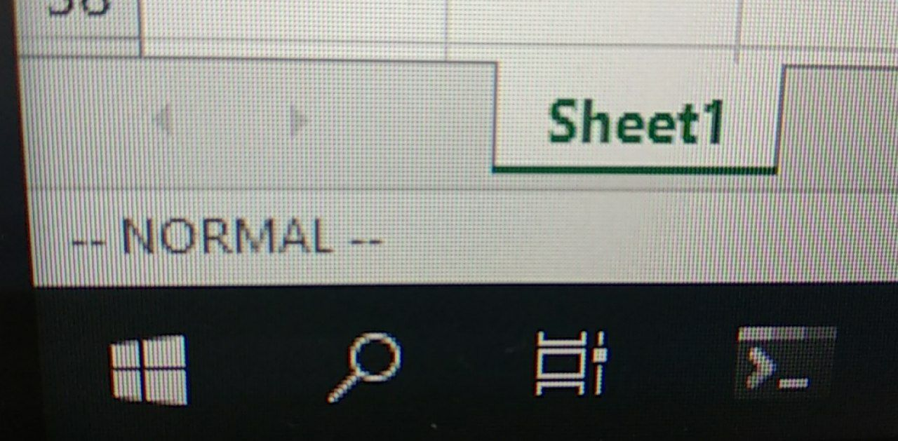

# vixcel
.xlam for vim shortcuts in excel

  

- hljk movements
- v for visual mode (hljk will expand selection)
- i for insert mode

- C-a increment rightmost number in cell.value
- J append bottom cell value

